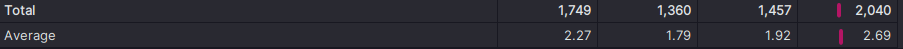

# GL_Projet1_Groupe5_Fabio_VANDEWAETER
Dépôt Github avec le rendu : https://github.com/fabiovandewaeter/GL_Projet1_Groupe5_Fabio_VANDEWAETER

Explication des dossiers et fichiers du dépôt du Projet1 :
- `bac_a_sable` contient l'archive du dépôt `gson` à analyser ainsi qu'un main Java pour pouvoir expérimenter (lancer avec la commande `make main`)
- `README.md` sert de compte rendu à ce Projet 1

## 1) Présentation globale du projet

Il s'agit du logiciel GSon qui a été forké :
https://github.com/fabiovandewaeter/gson

### 1.1) Utilité du projet
#### Fonctionnement du projet
Ce programme permet, en Java, de convertir des objets Java en JSON, et inversement, avec des méthodes fonctionnant comme un `toString()`

Par exemple, on peut convertir du Java en Json grâce à la méthode `gson.toJson()` en passant en paramètre l'objet Java à convertir :

```java
import com.google.gson.Gson;
import com.google.gson.GsonBuilder;

public class Main{
    public static void main(String[] args){
        GsonBuilder builder = new GsonBuilder();
        Gson gson = builder.create();

        // Convertion d'éléments simples
        System.out.println("1 => " + gson.toJson(1));
        System.out.println("test => " + gson.toJson("test"));
        final int[] list = { 1, 2, 3 };
        System.out.println("{1,2,3} => " + gson.toJson(list));
        
        // Convertion d'objets complets
        Cube cube = new Cube("red", 10, 50);
        System.out.println("Cube(\"red\", 10, 10) => " + gson.toJson(cube));
    }
    
    public static class Cube{
        private String color;
        private int height;
        private int width;

        public Cube(String color, int height, int width){
            this.color = color;
            this.height = height;
            this.width = width;
        }
    }
}
```

Ce qui affiche :

```
1 => 1
test => "test"
{1,2,3} => [1,2,3]
Cube("red", 10, 10) => {"color":"red","height":10,"width":50}
```

Dans l'autre sens, il est possible de convertir du Json, sous forme de chaîne des caractères, en un objet Java, grâce à la méthode `gson.fromJson()` en passant en paramètre la chaine de caractère Json à convertir ainsi que la classe de l'objet à retourner :

```java
import com.google.gson.Gson;
import com.google.gson.GsonBuilder;

public class Main{
    public static void main(String[] args){
        GsonBuilder builder = new GsonBuilder();
        Gson gson = builder.create();

        // Convertion à partir du Json
        Cube cube = new Cube("red", 10, 50);
        String convertedCube = gson.toJson(cube);
        System.out.println("Cube(\"red\", 10, 10) => " + convertedCube);
        Cube cube2 = gson.fromJson(convertedCube, Cube.class);
        System.out.println("Cube(\"red\", 10, 10) => " + gson.toJson(cube2));
        System.out.println("Même objet ? " + cube.equals(cube2));
    }
    
    public static class Cube{
        private String color;
        private int height;
        private int width;

        public Cube(String color, int height, int width){
            this.color = color;
            this.height = height;
            this.width = width;
        }
    }
}
```

Ce qui nous donne bien un nouvel objet avec les mêmes valeurs en attributs que l'ancien, même après convertion en Json : 

```
Cube("red", 10, 10) => {"color":"red","height":10,"width":50}
Cube("red", 10, 10) => {"color":"red","height":10,"width":50}
Même objet ? false
```

#### Créer l'archive du programme
##### > Sans Maven ou Gradle
A la racine du projet, faire `mvn clean verify` pour obtenir l'archive dans le dossier `gson/gson/target/gson-2.10.2-SNAPSHOT.jar`

Le dépôt contient divers dossiers, par exemple `gson/extras` qui contient des fonctionnalités non fournies par défaut ou `gson/metrics` qui permet aux développeurs de faire des benchmarks de leur côté, mais le dossier le plus important, avec plus de 200 classes, est le dossier `gson/gson`, qui permet d'obtenir l'archive principale

##### > Avec Gradle/Android

D'après le Readme, il suffit d'ajouter cette dépendance :

```gradle
dependencies {
    implementation 'com.google.code.gson:gson:2.10.1'
}
```

##### > Avec Maven2/3
Toujours d'après le Readme, il faut ajouter ceci :

```xml
<dependencies>
    <!--  Gson: Java to JSON conversion -->
    <dependency>
      <groupId>com.google.code.gson</groupId>
      <artifactId>gson</artifactId>
      <version>2.10.1</version>
      <scope>compile</scope>
    </dependency>
</dependencies>
```

### 1.2) Description du projet

#### Readme

Le dépôt contient un Readme à jour malgré le fait que le projet soit en "maintenance mode" (d'après le Readme), donc qu'il ne soit plus prévu d'ajouter des fonctionnalités

#### Documentation

En plus du fichier `README.md`, le fichier `GsonDesignDocument.md` donne des détails sur les choix faits lors de la conception du programme

Le fichier `Troubleshooting.md`, quant à lui, détaille le fonctionnement des exceptions

Le fichier `UserGuide.md` vient compléter le Readme dans tous ses aspects

Ces informations sont suffisantes pour permettre d'utiliser le programme

## 2) Historique du logiciel
### 2.1) Analyse du git

#### Composition de l'équipe
Le projet compte 145 contributeurs mais les 6 plus gros contributeurs ont participé significativement plus que les autres

La grande majorité des contributions ont eu lieu entre 2008 et 2015

#### Activité du projet
Le projet a été crée en 2008 et étant en "maintenance mode" depuis 2014 (ce qui signifie ici qu'il n'y aura pas de nouvelles fonctionnalités ajoutées), il est donc normal de voir que pratiquement aucun commit n'a eu lieu depuis 2014


#### Branches

Il y a eu 18 branches au total et 8 branches sont encore actives dont :
- la branche `main`
- 6 branches gérée par `dependabot`, un programme qui met automatiquement à jour les dépendances du projet Github
- une branche gérée par `OSSF Scorecard` qui gère la sécurité du projet

#### Pull requests

Les pulls requests sont utilisées depuis 2015 sur le dépôt, avec des labels en fonction du type de modifications à apporter ; il y a actuellement 105 pulls requests ouvertes, notamment pour mettre à jour des dépendances, et 874 fermées

## 3) Architecture logicielle
### 3.1) Utilisation de bibliothèques extérieures


Le tableau ci-dessus présente le nombre de classes dont dépend une classe (Dcy) ainsi que le nombre de packages dont elle dépend (PDpt) ; on constate que la moyenne est assez faible dans les deux cas, mais que des classes très importantes comme `com.google.gson.Gson` dépend de beaucoup plus de classes ou packages, ce qui était prévisible

Les classes dépendent souvent de packages du projet, notamment des packages de `com.google.gson.internal`


### 3.2) Organisation en paquetages
Le projet `gson/gson` est composé de 9 packages, qui se trouvent dans le dossier `gson/gson/src/main/java` :
> `com.google.gson` contient tous les autres packages
>> `com.google.gson.annotations` qui fournit des annotations qui peuvent être utilisées avec le projet

>> `com.google.gson.internal` qui permet au projet de fonctionner mais ne doit pas être accédé directement
>>> `com.google.gson.internal.bind`
>>>> `com.google.gson.internal.bind.util`

>>> `com.google.gson.internal.reflect`

>>> `com.google.gson.internal.sql`

>> `com.google.gson.reflect` qui donne des informations sur les types
>> `com.google.gson.stream` qui fournit des classes pour traiter le JSON de manière efficace

Dans le dossier `gson/gson/src/test/java` on retrouve globalement la même structure avec quelques changements :
1) `com.google.gson.annotations` n'est pas testé
2) `com.google.gson.common` est un nouveau package qui ajoute des méthodes pour les autres tests
2) `com.google.gson.functional` est un nouveau package qui test le projet de façon plus globale avec des tests fonctionnels
3) `com.google.gson.metrics` est un nouveau package qui test les performances
4) `com.google.gson.regression` est un nouveau package

Globalement, les packages ont des noms pertinents et séparent les fonctions du projet de façon pertinente, en plus de rester cohérent avec la structure des test

Les classes du package `com.google.gson.internal` semblent utiliser des Factory pattern ou Adapter pattern si on se base sur leurs nom et sur le package dans lequel elles sont placées

### 3.3) Répartition des classes dans les paquetages
Le projet comporte 252 classes au total dont 202 dans `gson/gson`, avec 83 classes dans `gson/gson/src/main` et 119 classes de test dans `gson/gson/src/test`

La majorité des classes se trouvent uniquement dans le packetage `com.google.gson` mais le le package `com.google.gson.reflect` ne contient qu'une classe, ce qui montre que ce choix de répartition en package est pertinent

### 3.4) Organisation des classes


Le tableau ci-dessus présente, pour les classes, le nombre de dépendences (Dcy), de dépendences de packages (PDpt) ainsi que le couplage entre deux objets

On constate que les classes sont très dépendantes les unes des autres et que l'on ne peut pas réellement les réutiliser ou les modifiers sans impacter les autres


Ce second tableau, quant à lui, donne le couplage afférent (Ca), le couplage efferent (Ce) et l'instabilité (I) des packages ; ceci va dans le sens de la conclusion tirée du premier tableau

## 4) Analyse approfondie
### 4.1) Tests
On lance les tests dans le dossier `gson/gson` grâce à la commande `mvn test`

#### Metrics


Le tableau ci-dessus présente des statistiques sur les tests JUnit du dossier `gson/gson/src/test` avec le nombre d'assertions de test (JTA), le nombre de classes de test (JTC) et le nombre de méthodes de test (JTM)

Comme on pouvait s'y attendre les packages `com.google.gson.regression` et `com.google.gson.metrics` et `com.google.gson.common` comportent peu de tests car ils sont là pour compléter les autres tests ou n'ont pas besoin d'être testés

#### Coverage


Sonarqube indique 89.6% du code de `gson/gson/src/main` est testé, ce qui est satisfaisant car les classes essentielles sont bien testées

#### Type de tests
Les tests sont des tests unitaires sauf dans le package `com.google.gson.functional` qui contient des test fonctionnel, ce qui permet de tests les méthodes mais aussi de vérifier qu'elles intéragissent bien entre-elles du début à la fin

#### Resultat des tests


Les tests 1360 tests passent sans erreurs et même si 19 ne sont pas exécutés, cela est très satisfaisant

#### Améliorations possibles

On pourrait ajouter des tests aux classes `com.google.gson.JsonParser` et `com.google.gson.JsonElement` qui ont environ 50% de coverage, puis compléter certaines classes de tests pour tester des cas relativements simples qui ne sont pas encore testés

### 4.2) Commentaires
#### Nombre de lignes de commentaire


Le tableau ci-dessus présente différentes statistiques sur la javadoc de `gson/gson`, avec le coverage des classes (Jc), le coverage des attributs (Jf), le nombre de lignes de javadoc (JLOC) ainsi que le coverage des méthodes (Jm)

#### Type de commentaire
Le code est largement commenté dans le format de la Javadoc, avec les licences en début de fichier

#### Parties sans commentaires | Conclusion

Le code est donc largement commenté en dehors des packages `com.google.gson.internal`, car ces derniers ne sont pas censé être accédés directement lors de l'utilisation de l'API ; cela peut poser problème pour les développeurs eux-mêmes qui pourraient ne pas s'y retrouver par manque de documentation, et il serait pertinent d'ajouter des commentaires à certaines méthodes, notamment pour expliquer dans quel contexte elles sont utilisées dans le projet

### 4.3) Dépréciation
Le code déprécié est voué à ne plus être utilisable, c'est donc une bonne raison de le remplacer ; on trouve du code déprécié dans ces classes :
#### com.google.gson.internal.bind.TypeAdapters
- `java.security.AccessController.doPrivileged(PrivilegedAction<Field[]> action)` ligne 969 qui est marquée comme dépréciée
#### com.google.gson.stream.JsonWriter
- `public final void setLenient(booblean lenient)` ligne 312 est marquée comme dépréciée
#### com.google.gson.stream.JsonReader
- `public final void setLenient(boolean lenient)` ligne 332 est aussi marquée comme dépréciée
#### com.google.gson.Gson
- `public Excluder excluder()` ligne 408 est marquée comme dépréciée
#### com.google.gson.GsonBuilder
- `public GsonBuilder setLenient()` ligne 548 est marquée comme dépréciée
#### com.google.gson.JsonArray
- `public char getAsCharacter()` ligne 371 est marquée comme dépréciée
#### com.google.gson.JsonElement
- `public JsonElement()` ligne 40 est marquée comme dépréciée
- `public char getAsCharacter()` ligne 275 est marquée comme dépréciée
#### com.google.gson.JsonNull
- `public JsonNull()` ligne 40 est marquée comme dépréciée
#### com.google.gson.JsonParser
- `public JsonParser()` ligne 38 est marquée comme dépréciée
- `public JsonElement parse(String json) throws JsonSyntaxException` ligne 118 est marquée comme dépréciée
- `public JsonElement parse(Reader json) throws JsonIOException, JsonSyntaxException` est marquée comme dépréciée
- `public JsonElement parse(JsonReader json) throws JsonIOException, JsonSyntaxException` est marquée comme dépréciée

### 4.4) Duplication de code
Il n'y a pratiquement pas de duplication de code, mais on peut trouver du code dupliqué dans le fichier `gson/gson/src/main.java/com/google/gson/internal/bind/TypeAdapters.java`, de façon très légère, par exemple pour les lignes 197-209 et 232-244, mais cela se répère dans les méthodes de type `public statis final TypeAdapter<T>` :
```java
  public static final TypeAdapter<Number> SHORT =
      new TypeAdapter<Number>() {
        @Override
        public Number read(JsonReader in) throws IOException {
          if (in.peek() == JsonToken.NULL) {
            in.nextNull();
            return null;
          }

          int intValue;
          try {
            intValue = in.nextInt();
          } catch (NumberFormatException e) {
            throw new JsonSyntaxException(e);
          }
```
```java
  public static final TypeAdapter<Number> BYTE =
      new TypeAdapter<Number>() {
        @Override
        public Number read(JsonReader in) throws IOException {
          if (in.peek() == JsonToken.NULL) {
            in.nextNull();
            return null;
          }

          int intValue;
          try {
            intValue = in.nextInt();
          } catch (NumberFormatException e) {
            throw new JsonSyntaxException(e);
          }
```

#### Améliorations possibles

Il semble possible d'améliorer cela en créant de petites fonctions qui gèrent les différentes parties communes à ces méthodes

### 4.5) God Classes
Même si la majorité des classes sont peu complexes, quelques-unes sont particuliérement imposantes ; par exemple ces classes ont une complexité (WMC) particuliérement élevée :


Il en va de même pour les fichiers de tests de ces classes, mais cela est moins impactant

#### Améliorations possibles
Avec beaucoup de temps il serait possible de séparer ces classes en sous-classes plus spécialisées et simples à maintenir, même si cela demanderai beaucoup de temps

### 4.6) Analyse des méthodes

#### Complexité cyclomatique



Le tableau ci-dessus nous donne la complexité cyclomatique (v(G)) totale et moyenne, et même si cette dernière basse, certaines méthodes sont beaucoup plus complexes, comme par exemple la méthode `com.google.gson.stream.JsonReader.doPeek()` qui a une complexité cyclomatique de 40 avec la même méthode de calcul, ce qui est problématique (il semble important de réduire la taille de cette fonction en en créant d'autres plus petites, car le développement de cette méthode risque d'être fastidieux) :

```java
int doPeek() throws IOException {
    int peekStack = stack[stackSize - 1];
    if (peekStack == JsonScope.EMPTY_ARRAY) {
      stack[stackSize - 1] = JsonScope.NONEMPTY_ARRAY;
    } else if (peekStack == JsonScope.NONEMPTY_ARRAY) {
      // Look for a comma before the next element.
      int c = nextNonWhitespace(true);
      switch (c) {
        case ']':
          return peeked = PEEKED_END_ARRAY;
        case ';':
          checkLenient(); // fall-through
        case ',':
          break;
        default:
          throw syntaxError("Unterminated array");
      }
    } else if (peekStack == JsonScope.EMPTY_OBJECT || peekStack == JsonScope.NONEMPTY_OBJECT) {
      stack[stackSize - 1] = JsonScope.DANGLING_NAME;
      // Look for a comma before the next element.
      if (peekStack == JsonScope.NONEMPTY_OBJECT) {
        int c = nextNonWhitespace(true);
        switch (c) {
          case '}':
            return peeked = PEEKED_END_OBJECT;
          case ';':
            checkLenient(); // fall-through
          case ',':
            break;
          default:
            throw syntaxError("Unterminated object");
        }
      }
      int c = nextNonWhitespace(true);
      switch (c) {
        case '"':
          return peeked = PEEKED_DOUBLE_QUOTED_NAME;
        case '\'':
          checkLenient();
          return peeked = PEEKED_SINGLE_QUOTED_NAME;
        case '}':
          if (peekStack != JsonScope.NONEMPTY_OBJECT) {
            return peeked = PEEKED_END_OBJECT;
          } else {
            throw syntaxError("Expected name");
          }
        default:
          checkLenient();
          pos--; // Don't consume the first character in an unquoted string.
          if (isLiteral((char) c)) {
            return peeked = PEEKED_UNQUOTED_NAME;
          } else {
            throw syntaxError("Expected name");
          }
      }
    } else if (peekStack == JsonScope.DANGLING_NAME) {
      stack[stackSize - 1] = JsonScope.NONEMPTY_OBJECT;
      // Look for a colon before the value.
      int c = nextNonWhitespace(true);
      switch (c) {
        case ':':
          break;
        case '=':
          checkLenient();
          if ((pos < limit || fillBuffer(1)) && buffer[pos] == '>') {
            pos++;
          }
          break;
        default:
          throw syntaxError("Expected ':'");
      }
    } else if (peekStack == JsonScope.EMPTY_DOCUMENT) {
      if (strictness == Strictness.LENIENT) {
        consumeNonExecutePrefix();
      }
      stack[stackSize - 1] = JsonScope.NONEMPTY_DOCUMENT;
    } else if (peekStack == JsonScope.NONEMPTY_DOCUMENT) {
      int c = nextNonWhitespace(false);
      if (c == -1) {
        return peeked = PEEKED_EOF;
      } else {
        checkLenient();
        pos--;
      }
    } else if (peekStack == JsonScope.CLOSED) {
      throw new IllegalStateException("JsonReader is closed");
    }

    int c = nextNonWhitespace(true);
    switch (c) {
      case ']':
        if (peekStack == JsonScope.EMPTY_ARRAY) {
          return peeked = PEEKED_END_ARRAY;
        }
        // fall-through to handle ",]"
      case ';':
      case ',':
        // In lenient mode, a 0-length literal in an array means 'null'.
        if (peekStack == JsonScope.EMPTY_ARRAY || peekStack == JsonScope.NONEMPTY_ARRAY) {
          checkLenient();
          pos--;
          return peeked = PEEKED_NULL;
        } else {
          throw syntaxError("Unexpected value");
        }
      case '\'':
        checkLenient();
        return peeked = PEEKED_SINGLE_QUOTED;
      case '"':
        return peeked = PEEKED_DOUBLE_QUOTED;
      case '[':
        return peeked = PEEKED_BEGIN_ARRAY;
      case '{':
        return peeked = PEEKED_BEGIN_OBJECT;
      default:
        pos--; // Don't consume the first character in a literal value.
    }

    int result = peekKeyword();
    if (result != PEEKED_NONE) {
      return result;
    }

    result = peekNumber();
    if (result != PEEKED_NONE) {
      return result;
    }

    if (!isLiteral(buffer[pos])) {
      throw syntaxError("Expected value");
    }

    checkLenient();
    return peeked = PEEKED_UNQUOTED;
  }
```

#### Analyse des commentairse

Même si nous avons vu que le coverage Javadoc du code est élevé, cette méthode `com.google.gson.stream.JsonReader.doPeek()` n'a aucun commentaires alors qu'elle est très complexe, ce qui aggrave le problème

Plusieurs méthodes complexes de cette classe ne sont pas testées non-plus, ce qui est un vrai problème

#### Nombre de lignes de codes

D'après les outils d'analyses d'IntelliJ, il y a en moyenne 14.50 lignes de code par méthode, ce qui est élevé et est expliqué par le fait qu'il existe beaucoup de méthodes complexes comme `com.google.gson.stream.JsonReader.doPeek()` pour analyser le code et le traduire du Java au Json ou inversement

#### Nombre d'arguments

La moyenne du nombre d'arguments est à 1.01, cependant il existe 14 méthodes avec plus de 3 paramètres, ce qui est faible au vu du nombre de méthodes, cependant le constructeur `com.google.gson.Gson.Gson()` demande 21 paramètres, ce qui est très élevé

En dehors des constructeurs, on peut trouver les méthodes `com.google.gson.internal.bind.ReflectiveTypeAdapterFactory.createrBoundField()` avec 7 paramètres et `com.google.gson.internal.bind.MapTypeAdapterFactory.Adapter.Adapter()` avec 6 paramètres ; de façon plus générale, les méthodes du package `com.google.gson.internal` ont souvent plus de 3 paramètres, ce qui peut s'expliquer par le fait qu'elles ne soient pas destinées à être utilisées en dehors du développement du projet, même si cela est également problématique car complexifie la maintenance du code

## 5) Nettoyage de Code et Code smells


Sonarcube détecte 382 code smells mais estime que cela est peu


Même si le code fonctionne, il serait très intéressant de supprimer ces code smells et sonarcube estime que cela pourrait demander moins de 30 minutes pour une grande partie des code smells, et à l'extrême la classe `com.google.gson.stream.JsonReader` pourrait demander plus d'un jour de travail pour traiter cette dette technique

### 5.1) Règles de nommage
#### Conventions de nommage Java
On peut trouver des éléments qui ne respectent pas les conventions de nommage de Java, ce qui peut créer de l'ambiguité et des quiproquo pour un développeur qui ne connait pas déjà le code
##### com.google.gson.internal.JavaVersion
- `private statis final int majorJavaVersion` qui être doit écrit en majuscule et snake case
##### com.google.gson.internal.JsonReaderInternalAccess
- `public static volatile JsonReaderInternalAccess INSTANCE` qui devrait être passé en final ou renommé
##### com.google.gson.internal.bind.JsonTreeReader
- `private String locationString()` devrait passer en publique pour remplacer la méthode du même nom de sa classe parent
##### com.google.gson.internal.bind.JsonTreeWriter
- `private JsonElement peek` devrait aussi passer en public
##### com.google.gson.internal.bind.ReflectiveTypeAdapterFactory
- `abstract T finalize(A accumulator)` devrait être renommée pour éviter de la confondre avec `Object.finalize()`
- `T finalize(T accumulator)` ligne 562, pour les mêmes raisons
- `T finalize(T accumulator)` ligne 642, pour les mêmes raisons
##### com.google.gson.internal.sql.SqlTimestampTypeAdapter
- `final TypeAdapter<Date> dateTypeAdapter` ligne 37 devrait être écrit en majuscule et snake case

#### Autres améliorations possibles
En dehors de ces problèmes de conventions Java, les variables ou méthodes du code principal ou des tests ont en grande majorité des noms pertinents qui reflètent leur utilité dans le projet et respectent les conventions de nommage

### 5.2) Nombre magique
Pratiquement tous les nombres sont utilisés à travers de constantes avec des noms pertinents (il n'y a pas de nombres magiques dans les tests par exemple), cependant il existe quelques exemples de nombres magiques, ce qui risque de poser problème aux prochaines personnes qui auront à maintenir ce projet, car elles ne comprendront pas forcément la signification de ces nombres :
#### com.google.gson.internal.bind.TypeAdapters
- `int value = src.get(i) ? 1 : 0;` ligne 142, où il serait possible de donner des noms au 1 et au 0, pour connaitre leur signification directement
- `// Allow up to 255 to support unsigned values if (intValue > 255 || intValue < Byte.MIN_VALUE)`
ligne 210, où le 255 pourrait être remplacé par une constante, avec un nom pertinent, au lieu d'ajouter un commentaire au dessus, par exemple Byte.MAX_VALUE
- `// Allow up to 65535 to support unsigned values if (intValue > 65535 || intValue < Short.MIN_VALUE)` ligne 245, où le 65535 pourrait aussi être remplaçé par une constante, par exemple Short.Max_VALUE
#### com.google.gson.internal.NumberLimits
- `if (Math.abs((long) decimal.scale()) >= 10_000)` ligne 26, qui n'utilise pas la constante `private statis final int MAX_NUMBER_STRING_LENGTH = 10_000` déjà définie au début de la classe pour remplacer le 10_000 (si le nom ne convient pas, il faudrait alors créer une seconde constante ou en changer le nom)
#### com.google.gson.internal.LinkedTreeMap
- `return (key == null ? 0 : key.hashCode()) ^ (value == null ? 0 : value.hashCode());` ligne 525, où les 0 devraient être placés dans une constante pour signifier qu'ils sont la valeur par défaut
#### com.google.gson.internal.JavaVersion
- `return majorJavaVersion >= 9;` ligne 93, où le 9 devrait être placé dans une constante pour signifier la version minimale acceptée
#### com.google.gson.internal.$Gson$Types
- `return (lowerBound != null ? 31+ lowerBound.hashCode() : 1) ^ (31 + upperBound.hashCode());` ligne 671, où les 31 et 1 devraient être placés dans des constantes
#### com.google.gson.stream.JsonReader
- `builder = new StringBuilder(Math.max(estimatedLength, 16));` ligne 1091 et 1105, on peut remplacer les 16 par une constante
- `builder = new StringBuilder(Math.max(i, 16));` ligne 1160, pour la même raison
- `System.arraycopy(buffer, pos, buffer, 0, limit);` ligne 1416, pour expliquer ce qu'est le 0
#### com.google.gson.stream.JsonWriter
- `if (c < 128)` ligne 744, qui devrait être remplacé par une constante pour préciser qu'il s'agit de la limite supérieure de la valeur d'un char signé

### 5.3) Structure du code
On vérifie que :
1) les variables d'instance sont au début de leur classe
2) les méthodes publiques sont en haut et les privées plus bas
#### com.google.gson.internal.bind.DefaultDateTypeAdapter
2) les méthodes publiques et privées sont mélangées
#### com.google.gson.internal.bind.JsonAdapterAnnotationTypeAdapterFactory
2) les méthodes publiques et privées sont mélangées
#### com.google.gson.internal.bind.JsonTreeReader
2) les méthodes publiques et privées sont mélangées
#### com.google.gson.internal.bind.JsonTreeWriter
2) les méthodes publiques et privées sont mélangées
#### com.google.gson.internal.bind.NumberTypeAdapter
2) les méthodes publiques et privées sont mélangées
#### com.google.gson.internal.bind.ObjectTypeAdapter
2) les méthodes publiques et privées sont mélangées
#### com.google.gson.internal.bind.ReflectiveTypeAdapterFactory
2) les méthodes publiques et privées sont mélangées
#### com.google.gson.internal.bind.TreeTypeAdapter
2) les méthodes publiques et privées sont mélangées
#### com.google.gson.internal.reflect.ReflectionHelper
2) les méthodes publiques et privées sont mélangées
#### com.google.gson.internal.sql.SqlTimestampTypeAdapter
2) les méthodes publiques et privées sont mélangées
#### com.google.gson.internal.$Gson$Types
2) les méthodes publiques et privées sont mélangées
#### com.google.gson.internal.JavaVersion
2) les méthodes publiques et privées sont mélangées
#### com.google.gson.internal.LazilyParsedNumber
2) les méthodes publiques et privées sont mélangées
#### com.google.gson.internal.ReflectionAccessFilterHelper
2) les méthodes publiques et privées sont mélangées
#### com.google.gson.reflect.TypeToken
2) les méthodes publiques et privées sont mélangées
#### com.google.gson.stream.JsonReader
2) les méthodes publiques et privées sont mélangées
#### com.google.gson.FormattingStyle
2) les méthodes publiques et privées sont mélangées
#### com.google.gson.GsonBuilder
2) les méthodes publiques et privées sont mélangées
#### com.google.gson.JsonArray
2) les méthodes publiques et privées sont mélangées

#### Améliorations possibles
On pourra placer les variables d'instances en début de classe et les méthodes publiques avant les méthodes privées, afin d'avoir un code mieux ordonné, pour ne pas se perdre en cherchant des informations

### 5.4) Code mort
Comme il y a une API, beaucoup de code n'est pas appelé en interne, mais ce n'est pas un problème

### Autres code smells

On constate que beaucoup de méthodes avec une grande complexité cyclomatique consistent en des listes de if/else ou de switch/case, ce qui rend leur lisibilité et maintenance compliqué ; il serait donc pertinent de réduire la taille de ces méthodes, par exemple avec de plus petites méthodes ou en délégant ce travail à des sous classes, pour profiter du polymorphisme
